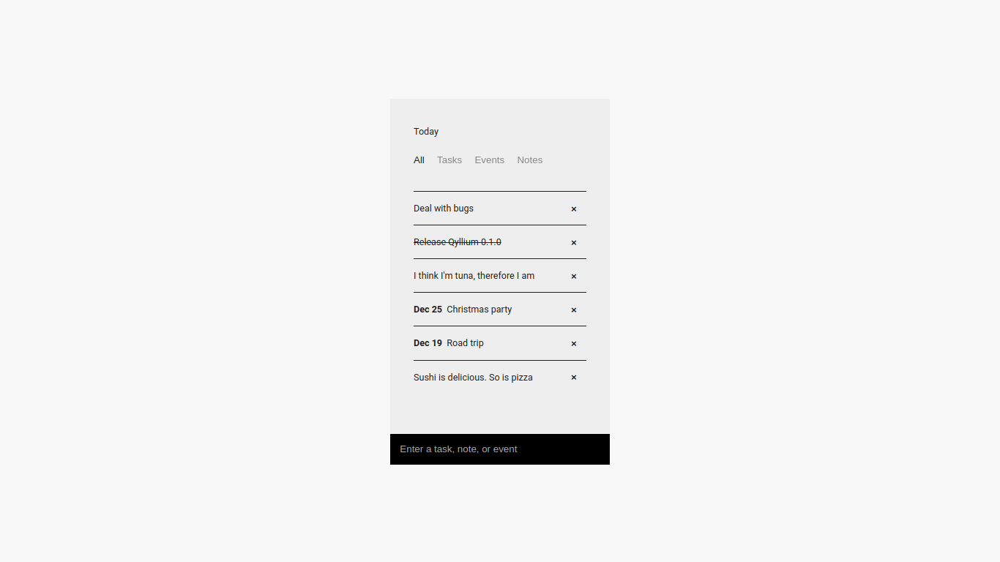

**Qyllium** is a simple note-taking app for Linux, macOS, and Windows. Download it [here](https://joshavanier.itch.io/qyllium).

## Development

```
npm install
npm start
```

---

Josh Avanier

[](https://twitter.com/joshavanier) [](https://joshavanier.com)
